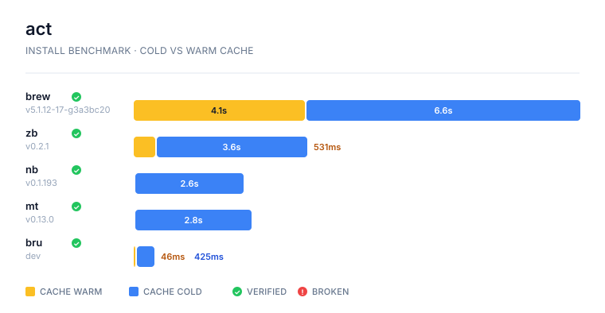
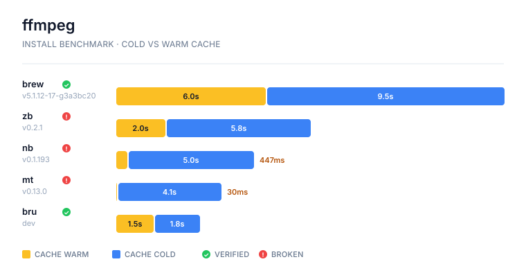
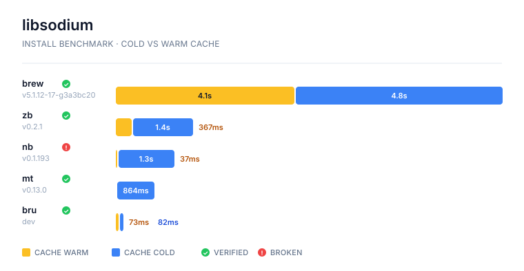
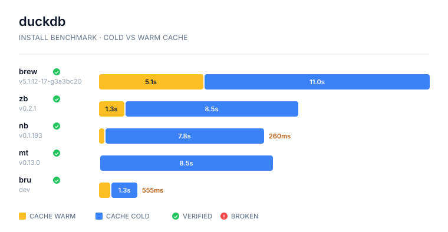
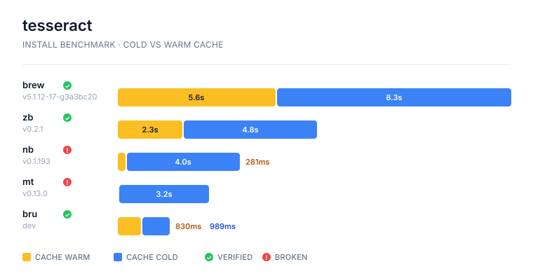
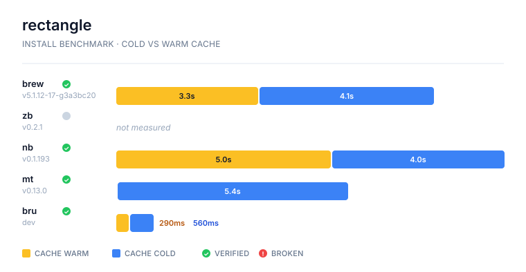

# bru

[https://zieka.github.io/bru](https://zieka.github.io/bru)

Homebrew, reimagined in native code.

A fast, native implementation of common Homebrew commands written in Zig. Drop-in compatible — falls back to `brew` for anything not yet implemented.

## Install

```bash
curl -fsSL https://zieka.github.io/bru/install.sh | bash
```

## Usage

Use `bru` exactly like you'd use `brew`:

```bash
bru install ripgrep
bru search fd
bru upgrade
bru services start postgresql@14
bru bundle dump
bru rollback ripgrep
```

## Commands

39 native commands including `install`, `upgrade`, `search`, `list`, `info`, `deps`, `doctor`, `cleanup`, plus:

- **services** — manage background services (start/stop/restart)
- **bundle** — export and install from Brewfiles
- **rollback** — revert a formula to its previous version
- **self-update** — update bru itself
- **post_install execution** — runs Homebrew `post_install` Ruby blocks via the system Ruby (`/usr/bin/ruby` on macOS), so packages like `node`, `openssl`, `fontconfig`, and `ca-certificates` are fully configured at install time. Disable per-invocation with `--no-post-install`, override the Ruby path with `--use-system-ruby=<path>`, or set `BRU_NO_POST_INSTALL=1`. Failures are logged to `<cache>/post-install-logs/` and never block the install.

Anything not implemented natively falls back to the real `brew` binary.

## How bru compares

### vs Homebrew

| | Homebrew | bru |
|---|---|---|
| **Language** | Ruby | Zig (single static binary) |
| **Startup** | ~1.5s interpreter load | Near-zero |
| **Formula lookups** | Parse 25MB JSON | O(1) via mmap'd binary index |
| **Auto-update** | Runs on every `install` | Never — `bru update` is explicit |
| **Rollback** | Not supported | `bru rollback <formula>` with full history |
| **Memory** | Ruby GC pauses | Arena allocator (free is a no-op) |
| **Downloads** | Sequential | Parallel with worker threads |

### vs zerobrew

| | zerobrew | bru |
|---|---|---|
| **Drop-in compatible** | No — separate `/opt/zerobrew` prefix, requires migration | Yes — same prefix, same Cellar, interchangeable with brew |
| **Fallback** | None — switch to brew manually | Transparent — unimplemented commands delegate to brew automatically |
| **Formula index** | Parses JSON API on every lookup | Binary index (BRUI format), mmap'd O(1) lookups |
| **Dependencies** | ~30 Rust crates, SQLite, Tokio | Zero — Zig stdlib only |
| **Binary size** | 7.9 MB | Single static binary, significantly smaller |
| **Migration** | Required (`zb migrate`) | Not needed — works on existing Homebrew installation |
| **Casks** | Not supported | `.app`, binary, and `.pkg` casks work — `.pkg` installs via `installer` and uninstalls via `pkgutil`/`delete`/`trash`/`rmdir`. A pkg cask whose `uninstall` needs steps bru lacks (`launchctl`, `quit`, `script`, `kext`) defers to brew rather than install something it can't cleanly remove |
| **Correctness** | Skips patching ffmpeg's `libav*.pc` pkg-config files — `@@HOMEBREW_PREFIX@@` placeholders leak through (see Benchmark below) | Full pkg-config patching alongside Mach-O relocation |

### vs nanobrew

| | nanobrew | bru |
|---|---|---|
| **Drop-in compatible** | No — separate `/opt/nanobrew` prefix | Yes — same prefix, same Cellar |
| **Fallback** | None — unsupported commands fail | Transparent — delegates to brew |
| **Tar extraction** | Shells out to system `tar` | Native Zig tar with parallel buffer pool |
| **Tab files** | Separate state tracking | Writes brew-compatible `INSTALL_RECEIPT.json` — brew sees bru-installed packages as its own |
| **Mach-O patching** | Patches dylibs but leaves `*.pc` files unpatched | Full relocation via `install_name_tool` + `codesign` for both binaries and pkg-config |
| **Data files** | Skips bundle data (e.g. tesseract `tessdata/eng.traineddata` doesn't extract) — `tesseract --list-langs` finds nothing | Extracts everything declared in the bottle |
| **Migration** | Required (`nb migrate`) | Not needed |

### vs malt

| | malt | bru |
|---|---|---|
| **Drop-in compatible** | No — separate `/opt/malt` prefix | Yes — same prefix, same Cellar |
| **Fallback** | None | Transparent — delegates to brew |
| **Warm-cache hot path** | Extracts to content-addressed store, then APFS `clonefile` into the user-visible Cellar (skips re-relocation on re-install) | Same APFS `clonefile` strategy, with the relocation cached per-bottle in `kegs/<sha>/` |
| **Mach-O patching** | Patches dylibs but partial pkg-config coverage — ffmpeg's `libavdevice.pc` ships with `@@HOMEBREW_PREFIX@@` placeholders | Full pkg-config patching |
| **Data files** | Same as nanobrew — tesseract `tessdata/` is missing after install | Extracts data subdirectories declared in the bottle |
| **Casks** | Supported | Supported |

### The key difference

bru is designed as a **transparent accelerator**, not a parallel ecosystem. The other native alternatives chase raw install speed by skipping the unglamorous patching work — pkg-config files, language data, signature re-application — leaving subtly broken installs that pass `<bin> --version` but fail real consumers (compilers calling `pkg-config --libs libsodium`, `tesseract --list-langs`, etc). bru does the full patching work, keeps the brew-compatible Cellar layout, and falls back to brew for anything unimplemented. Alias `brew=bru` and everything works — faster for native commands, identical for the rest.

## Benchmark (beta)

`test/benchmark/` ships an end-to-end correctness × speed benchmark that compares bru against brew and three other native homebrew-alikes (zerobrew, nanobrew, malt) by actually installing real formulae and casks.

For each `(tool, package)` pair the bench:

1. Uninstalls the package and surgically evicts every cached blob keyed by the bottle's SHA256 (brew API → cache/blobs + store, across each tool's content-addressed prefix).
2. Times a cold install (no cached bottle on disk).
3. Uninstalls again, times a warm install (bottle in cache but not yet linked).
4. Runs a **correctness probe** while the install is on disk:
    - `ffmpeg`: ffprobe present, every `libav*.pc` patched, `-filters` lists 200+ plugins, transcode a generated test pattern to PNG.
    - `libsodium`: dylib has no `@@PLACEHOLDER@@`, `lib/pkgconfig/libsodium.pc` exists and is patched.
    - `duckdb`: `libduckdb.dylib` install_name patched, `lib/cmake/DuckDB/*.cmake` clean, statically-linked parquet round-trip + json_extract both return expected values.
    - `tesseract`: `--list-langs` finds `eng`/`osd` (catches missing `tessdata/`).
    - `act`: binary launches, `--help` prints the expected usage banner.
    - `rectangle` (cask): `Rectangle.app` is in `/Applications/`, executable inside the bundle, `codesign --verify` passes.

**Run it:**

```bash
bash test/benchmark/bench_contenders.sh   # ensure latest brew, zb, nb, mt; build bru
bash test/benchmark/bench_chart.sh        # measure + render
```

Each per-package result lands at `test/benchmark/results-<package>.svg`. Green ✓ = verified, red `!` = passes `--version` but fails a deeper probe, grey dot = not supported by that tool.













**Beta caveats:**

- The deeper probes are formula-specific (hand-written per package). Adding a new package to `PACKAGES` / `CASKS` env vars works for timing but uses a `--version`-only fallback for correctness until a probe is written for it.
- "Cold" install timing depends on surgical cache eviction; the bench uses brew's API to derive per-tool cache paths, so a new tool with a custom content-addressing scheme would need its `clear_cache` function updated.
- Warm-cache numbers are sensitive to disk state and CPU load — run the bench on an otherwise-idle machine for trustworthy comparisons.

## Building from source

Requires [Zig](https://ziglang.org/) 0.15+:

```bash
zig build -Doptimize=ReleaseFast
```

Run tests:

```bash
zig build test
```
